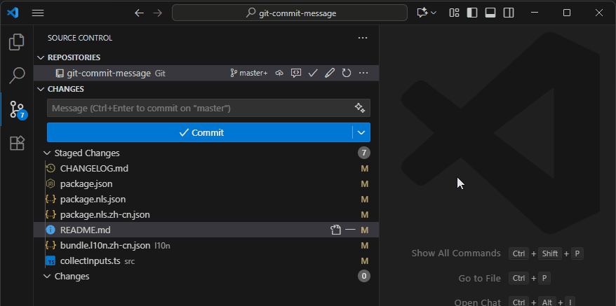
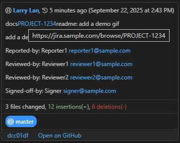

# Git Commit Message - Git 提交说明

Quickly edit git commit message using a fixed format

快速生成固定格式的 Git 提交说明

## Quick Start - 使用方法

Run `Git Commit Message` from the command palette or click the pencil icon in the upper right corner of the repository changed message input box.

使用命令面板运行 `Git Commit Message` 或点击仓库更改消息输入框右上角的铅笔图标按键



The hover details of the commits in the Git graph are as follows. Clicking on the issue link will take you to the configured Jira issue details page

Git 图形中提交的悬浮详细信息如下, 点击问题单链接可以跳转到配置的 Jira 问题详情页面



## Example in English

```
perf[PROJECT-1234]scope: summary

detail

BREAKING_CHANGE: breaking change

[PROJECT-1234]: https://jira.sample.com/browse/PROJECT-1234

Reported-by: Reporter <reporter@sample.com>

Reviewed-by: Reviewer <reviewer@sample.com>

Signed-off-by: Signer <signer@sample.com>
```

## 中文示例

```
优化[PROJECT-1234]范围: 摘要

详情

破坏性变更: 破坏性变更

[PROJECT-1234]: https://jira.sample.com/browse/PROJECT-1234

报告人: Reporter <reporter@sample.com>

审阅人: Reviewer <reviewer@sample.com>

提交人: Signer <signer@sample.com>
```

## Setting - 设置

```json
{
  "gitCommitMessage.language": "en-US",
  "gitCommitMessage.enableJira": true,
  "gitCommitMessage.reporters": [
    { "name": "Reporter1", "email": "reporter1@sample.com", "picked": true },
    { "name": "Reporter2", "email": "reporter2@sample.com" }
  ],
  "gitCommitMessage.reviewers": [
    { "name": "Reviewer1", "email": "reviewer1@sample.com", "picked": true },
    { "name": "Reviewer2", "email": "reviewer2@sample.com" }
  ],
  "gitCommitMessage.jiraPrefix": "PROJECT-",
  "gitCommitMessage.jiraUrl": "https://jira.sample.com/browse/",
  "gitCommitMessage.signerEmail": "signer@sample.com",
  "gitCommitMessage.signerName": "Signer"
}
```
